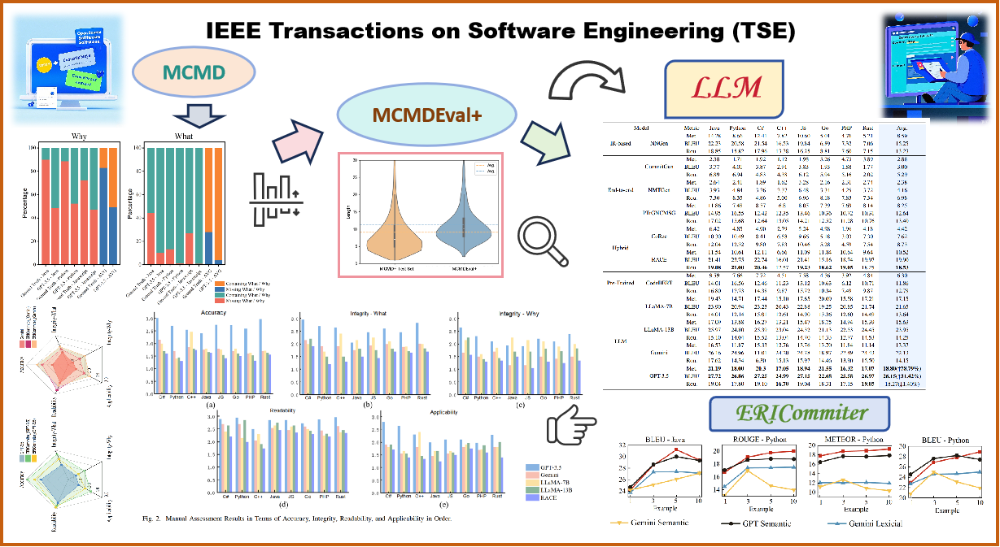
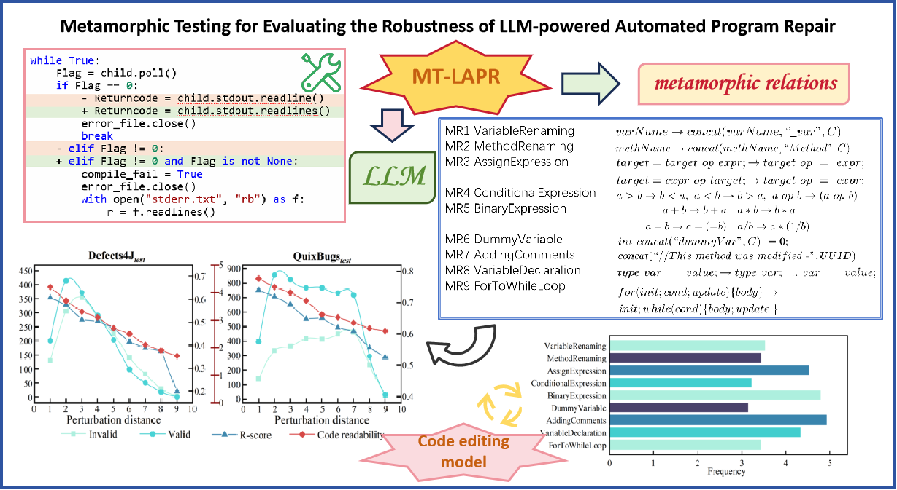








# 😉 About Me
I am an undergraduate student pursuing dual degrees in Information Engineering and Public Administration at Shandong University. My research focuses on cutting-edge applications of Large Language Models in software engineering, including code translation, automated program repair, and commit message generation. I have led multiple research projects collaborating with Peking University's Key Laboratory of High-Confidence Software Technology and Shandong University's Research Center for Architecture and Embedded Systems, under the guidance of **Prof. Zhen Yang (Shandong University)** and **Prof. Zhi Jin (Peking University, IEEE Fellow)**. I have published in top-tier venues including *IEEE Transactions on Software Engineering* (CCF-A).<a href='https://scholar.google.com/citations?user=RiFZe1YAAAAJ&hl=en=zh-CN'>

# 🔥 News
- *2024.12*: &nbsp;🎉🎉 Awarded Presidential Scholarship (Research Innovation), Shandong University's highest undergraduate honor!
- *2024.10*: &nbsp;🏆 National Scholarship recipient from China's Ministry of Education!
- *2024.10*: &nbsp;📚 One paper accepted at *IEEE Transactions on Software Engineering*!

# 📝 Publications 

TSE 2024

  
**Automated commit message generation with large language models: An empirical study and beyond**  
**Pengyu Xue**, Linhao Wu, Zhongxing Yu, Zhi Jin, Zhen Yang, Xinyi Li, Zhenyu Yang, Yue Tan.

*IEEE Transactions on Software Engineering* (CCF-A Journal), 2024  
[[PDF](https://ieeexplore.ieee.org/document/10713474)] | [[Code](https://github.com/Pengyu03/LLM-Commit-Message-Generation)]
- Led first comprehensive evaluation of LLMs for commit message generation
- Developed ERICommitter framework achieving 49.32% robustness improvement
- Curated high-quality dataset through multi-step filtering (360+ person-hours)

arXiv preprint 2024

  
**Escalating LLM-based code translation benchmarking into the Class-level era**  
**Pengyu Xue**, Linhao Wu, Zhen Yang, Chengyi Wang, Xiang Li, Yuxiang Zhang, Jia Li, Ruikai Jin, Yifei Pei, Zhaoyan Shen, Xiran Lyu, Jacky Wai Keung.

*arXiv preprint arXiv:2411.06145*, 2024  [[PDF](https://arxiv.org/pdf/2411.06145.pdf)]

- Built ClassEval-T benchmark covering Python/Java/C++
- Designed three novel translation strategies for real-world scenarios

arXiv preprint 2024

  
**Exploring and lifting the robustness of LLM-powered automated program repair with metamorphic testing**  
**Pengyu Xue**, Linhao Wu, Zhen Yang, Zhongxing Yu, Zhi Jin, Ge Li, Yan Xiao, Shuo Liu, Xinyi Li, Hongyi Lin, and Jingwen Wu.

*arXiv preprint arXiv:2410.07516*, 2024 (Under major revision at ISSTA 2025)  [[PDF](https://arxiv.org/pdf/2410.07516.pdf)]

- Created MT-LAPR testing framework with 9 metamorphic relations
- Integrated CodeT5-based model improving code readability by 32%

# 🎖 Honors and Awards
- *2024* Presidential Scholarship (Research Innovation) - Top 0.01% at SDU
- *2024* National Scholarship - Top 0.2% nationally
- *2024* National Second Prize, "Challenge Cup" Academic Competition
- *2024* ICM Honorable Mention - Interdisciplinary Contest in Modeling
- *2023-2024* First-Class Outstanding Student Award (Top 0.8%)

# 📖 Education
**Shandong University** (ARWU Top 101-150)  
*B.Eng in Information Engineering & B.A in Public Administration*  
Sept 2022 - Present

# 📊 Academic Activities
- **Oral Presentation**: China Information Fusion Conference 2023
- **Poster Presentation**: National Big Data & Social Computing Conference 2024
- **Research Grants**: 
  - ¥40,000 from SDU Graduate School (2024)
  - ¥10,000 National Innovation Program (2024)
